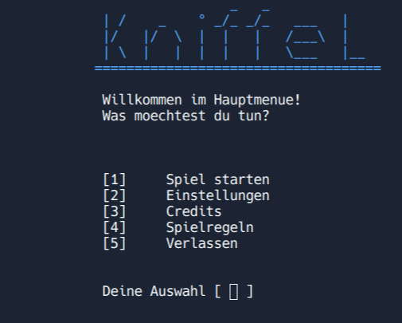
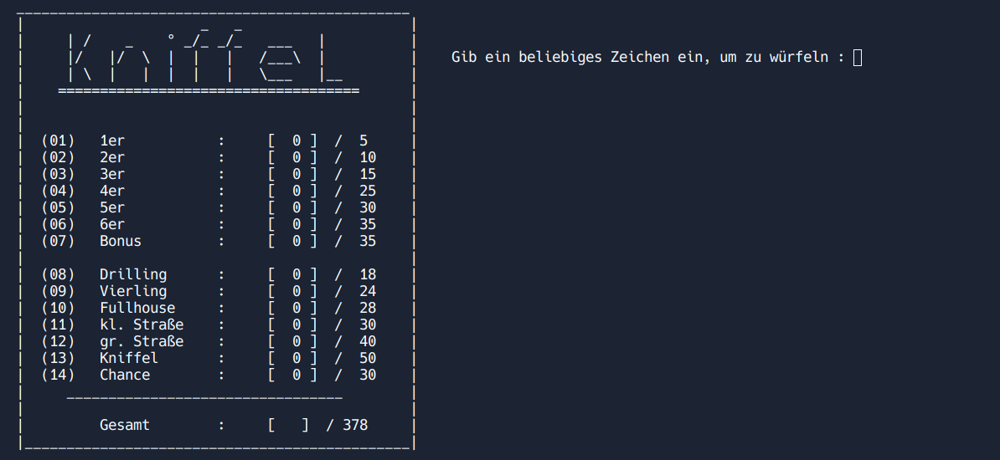
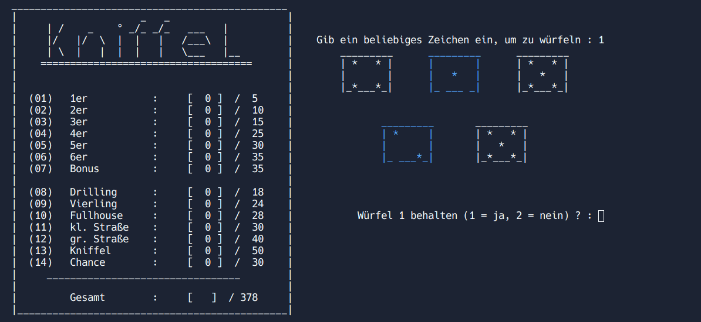

# yahtzee
A simple C++ implementation of a Yahtzee game (school year 2021) without using any game engine. This project demonstrates basic C++ programming concepts such as arrays, functions, and user input handling. The game is available only in German.

